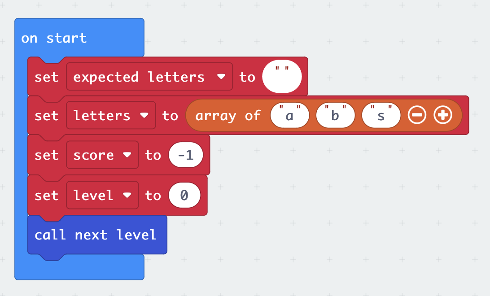
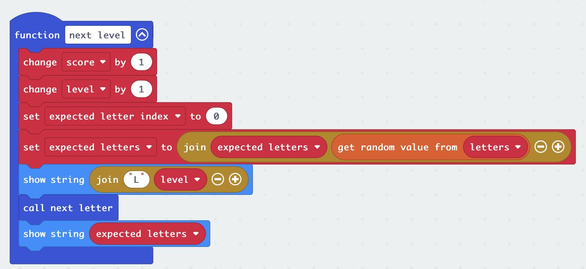
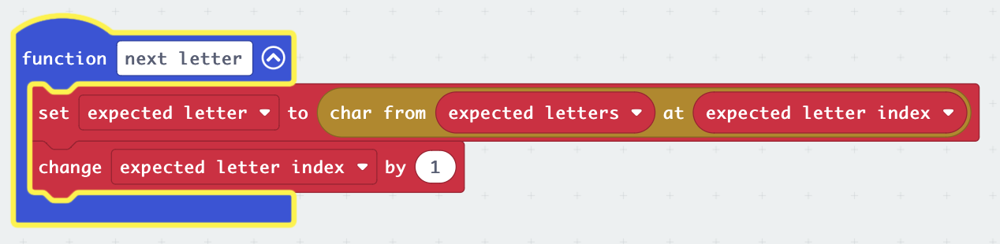
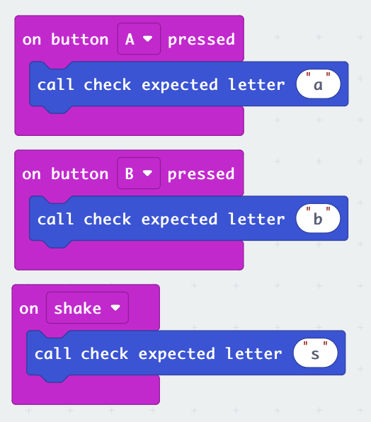

# Memory Game

Go to https://makecode.microbit.org

## Instructions

## Challenges

- Can you add other codes for different input, such as tilting the microbit?

- Instead of scrolling all of the `expected letters`, can you make it so only the _new_ letter it shown on the screen?
