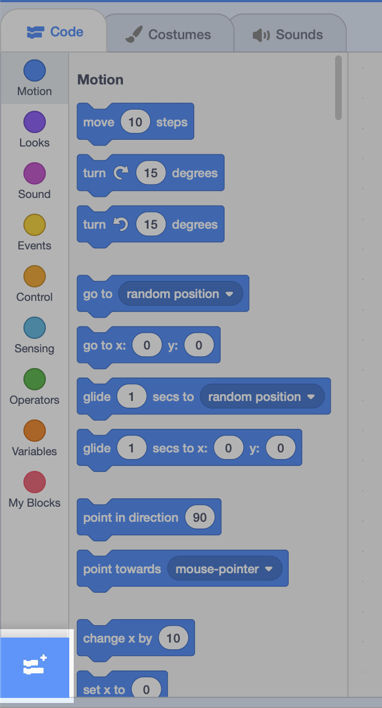
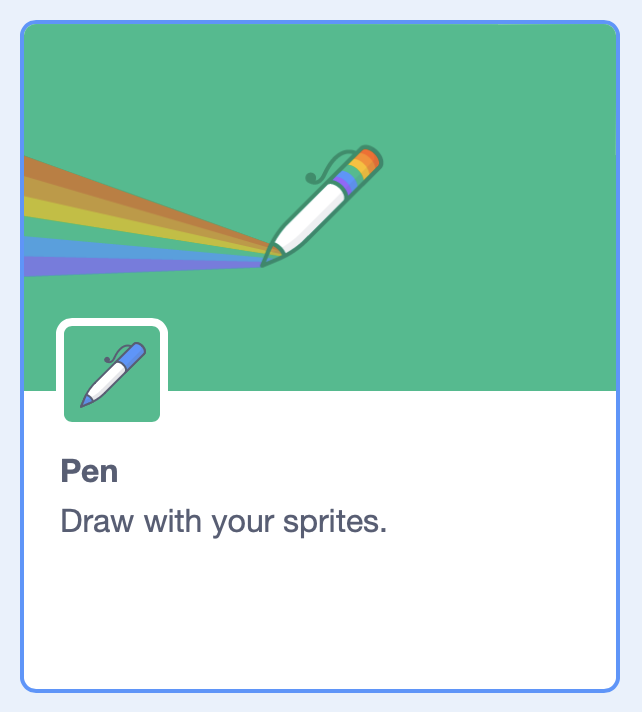
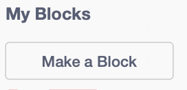
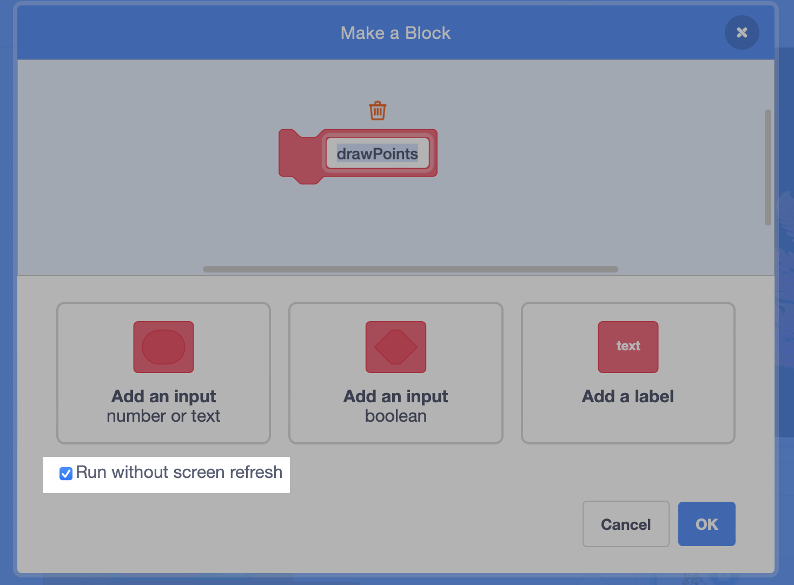
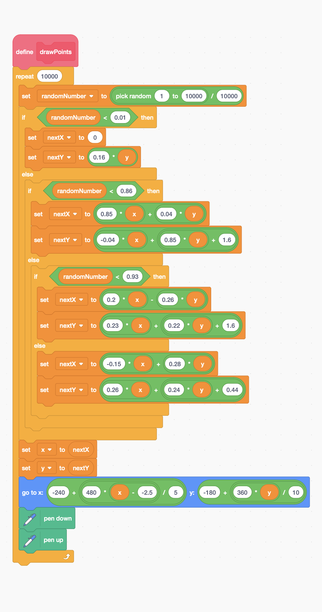
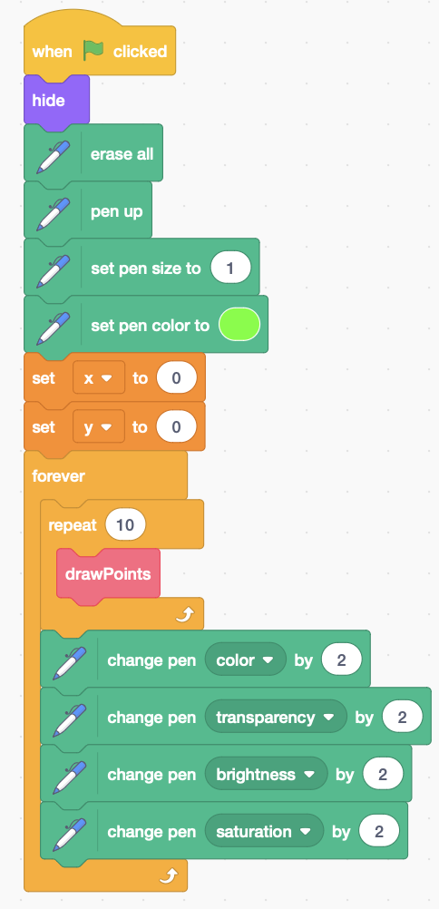
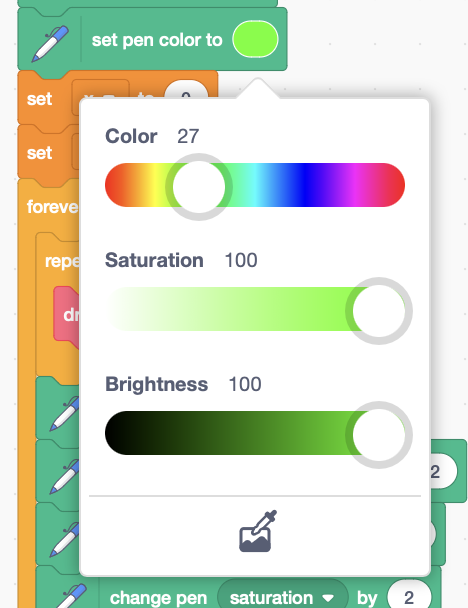

# Barnsley Fern

## Instuctions

## Challenges

- What happens if you don't _"Run without screen refresh"_ in the `drawPoints` block?

- Why does it eventually _appear_ to stop drawing? How can you stop this?