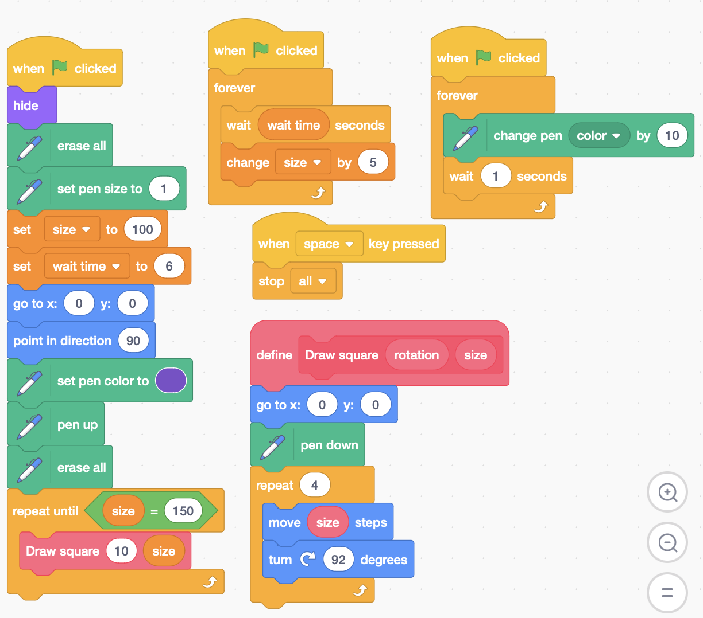

# Barnsley Fern

## Instuctions

## Challenges

- Play with the values for `size` and `wait time`

- Right click `Draw square`, select `Edit`, then select `Run without screen refresh`. What changes?